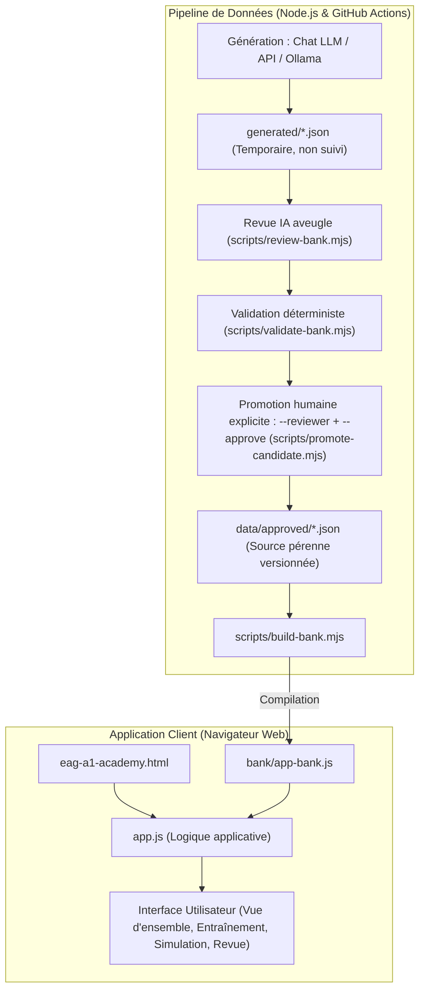
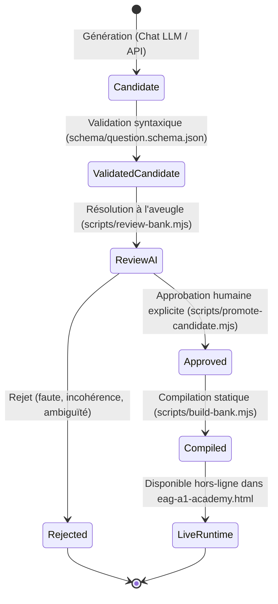

# Architecture du projet EAG A1 Académie

Ce document décrit l'architecture globale, les principes de conception technique, les flux de données et l'organisation du dépôt **EAG A1 Académie**.

---

## 1. Vue d'ensemble du système

Le projet est conçu selon deux sous-systèmes distincts et complémentaires :

1. **L'application d'entraînement côté client** : Une application web monopage (SPA) 100 % statique, exécutable sans serveur, respectueuse de la vie privée et sans dépendance d'exécution.
2. **Le pipeline de production & validation de données** : Un outillage en Node.js gérant l'ingestion, la validation déterministe, la revue critique par IA et la compilation des banques de questions.



---

## 2. Organisation du dépôt

```text
eag-a1-academy/
├── eag-a1-academy.html       # Point d'entrée de l'application (HTML5 sémantique + styles CSS)
├── app.js                    # Interface de l'application (rendu, navigation, chronomètres)
├── bank/app-bank.js          # Banque compacte générée par npm run build:bank (chargée avant app.js)
├── bank/admin-bank.js        # Schéma, banque complète et consignes pour admin.html (généré)
├── shared/session.js         # Tirage équilibré, ordre des options, notation, examen blanc (fonctions pures)
├── index.html                # Redirection d'appoint vers eag-a1-academy.html
├── admin.html / admin.js     # Interface d'administration (hors ligne ou via npm run admin)
├── shared/item-rules.js      # Règles communes navigateur + Node (schéma, contrôles, similarité, empreinte de contenu)
├── shared/chart.js           # Rendu SVG des graphiques (barres, courbes) pour l'application et l'admin
├── shared/calculator.js      # Calculatrice à l'écran des tests numériques (analyseur sans eval)
├── shared/timer.js           # Chronomètres monotones (résistent aux changements d'horloge ; pause pendant la veille système)
├── tests/e2e/                # Tests de bout en bout Playwright (application, administration, accessibilité)
├── playwright.config.mjs     # Configuration Playwright (bureau et mobile 375 px)
│
├── data/
│   ├── review-log/           # Journal des décisions de relecture (qui, quoi, quand, empreinte) ; contrôlé en CI
│   └── approved/             # Source de vérité pérenne : fichiers JSON validés par catégorie
│       ├── abstract.json
│       ├── numeric.json
│       ├── planning.json
│       ├── situational.json
│       └── verbal.json
│
├── generated/                # Zone de travail temporaire (scratchpad) ignorée par Git
│   └── .gitkeep
│
├── schema/
│   └── question.schema.json  # Schéma JSON Schema 2020-12, appliqué par Ajv dans validate-bank.mjs
│
├── scripts/
│   ├── admin-server.mjs      # Serveur local de l'interface d'administration (127.0.0.1, jeton)
│   ├── build-bank.mjs        # Compilation de data/approved/ vers bank/app-bank.js et bank/admin-bank.js
│   ├── check-review-log.mjs  # Contrôle CI : chaque question approuvée a une décision tracée
│   ├── generate-abstract-figures.mjs # Générateur déterministe de figures abstraites par règles géométriques
│   ├── generate-data-items.mjs # Générateur par règles : numérique (tableaux, graphiques) et agendas en tableau
│   ├── generate-bank.mjs     # Génération via API compatible OpenAI (consigne facultative)
│   ├── regenerate-bank.mjs   # Révision de questions approuvées par LLM (sortie : révisions à relire)
│   ├── promote-candidate.mjs # Promotion humaine explicite (relecteur nommé, identifiants listés)
│   ├── review-bank.mjs       # Revue aveugle par LLM, comparée à la clé par le script
│   ├── validate-bank.mjs     # Schéma (Ajv) + règles complémentaires (HTML interdit, notes, longueurs…)
│   └── lib/
│       ├── ai.mjs            # Client HTTP commun compatible OpenAI
│       ├── ids.mjs           # Numérotation des identifiants générés (suite des identifiants existants)
│       ├── rules.mjs         # Charge shared/item-rules.js (EagRules) dans Node
│       ├── review-rules.mjs  # Règles de la revue IA aveugle et de l'incrément de version
│       ├── file-transaction.mjs # Écriture atomique et rollback multi-fichiers
│       └── lockfile.mjs      # Verrou exclusif des écritures de la banque
│
├── prompts/
│   ├── generate-bank.md      # Consignes système et contraintes de génération
│   ├── revise-bank.md        # Consignes de révision de questions existantes
│   └── review-bank.md        # Consignes de résolution à l'aveugle
│
├── docs/
│   ├── ARCHITECTURE.md       # Présent document
│   ├── AI-QUESTION-BANKS.md  # Guide pratique de génération et enrichissement
│   ├── research/             # Benchmark psychométrique et cadre de référence
│   └── adr/                  # Architecture Decision Records (ADRs)
│
└── .github/workflows/
    ├── generate-test-bank.yml# Workflow de génération à la demande
    └── validate.yml          # Intégration continue (CI) et tests automatiques
```

---

## 3. Principes architecturaux clés

### 3.1. Exécution hors-ligne et compatibilité `file://`
* **Zéro serveur d'application** : L'utilisateur peut double-cliquer sur `eag-a1-academy.html` depuis son explorateur de fichiers.
* **Résolution du blocage CORS** : Les navigateurs bloquent souvent les requêtes `fetch()` vers des fichiers locaux sur le protocole `file://`. Pour contourner cette limite sans imposer de serveur web local (`localhost`), les questions validées sont compilées dans [`bank/app-bank.js`](../bank/app-bank.js) et [`bank/admin-bank.js`](../bank/admin-bank.js). Ces fichiers sont chargés par des balises `<script>` classiques avant la logique de l'application et de l'administration.

### 3.2. Confidentialité absolue (*Privacy by Design*)
* **Aucune télémétrie ni traceur** : Zéro cookie, aucun analytics tiers, aucun appel réseau vers des API externes au runtime.
* **État volatil en mémoire vive** : Les réponses, temps de passage et résultats ne sont stockés que dans l'objet JavaScript `state` en mémoire vive. Rien n'est écrit dans `localStorage` ni `sessionStorage` ; recharger la page réinitialise complètement la session.

### 3.3. Pipeline de données *Zero-Trust*
Tout contenu généré par un LLM est traité comme suspect jusqu'à preuve du contraire :
1. **Validation déterministe** : [`scripts/validate-bank.mjs`](../scripts/validate-bank.mjs) applique le [schéma](../schema/question.schema.json) avec Ajv, puis des règles complémentaires : aucun HTML ni entité, une seule note maximale placée sur la clé (jugement situationnel), options fourre-tout interdites, bonne réponse nettement plus longue signalée, unicité des identifiants, vocabulaire interdit.
2. **Revue IA aveugle** : le modèle relecteur résout chaque item sans voir la clé ; le script compare et ne conclut `pass` qu'en cas de concordance.
3. **Approbation humaine obligatoire** : `promote-candidate.mjs` exige un relecteur nommé et la liste explicite des identifiants approuvés ; la CI refuse toute PR qui laisse des fichiers dans `generated/`.

### 3.4. Rendu sûr et neutre
* **Tirage aléatoire équilibré par catégorie** : chaque session (entraînement, simulation de 15 questions, examen blanc de 5 tests de 10 questions) tire ses questions sans remise dans la catégorie, en répartissant le tirage sur toutes les compétences puis sur les niveaux de difficulté (`EagSession.drawBalanced`, `shared/session.js`). Le générateur aléatoire est injectable : les tests utilisent une graine fixe.
* **Raisonnement abstrait (Test géométrique)** : le stimulus de type `{ type: "shapes", text: "..." }` permet la représentation structurée et accessible de matrices 3×3 et de suites de figures (rotations, symétries, grilles d'éléments géométriques purs), sans dépendance d'image externe ni risque d'injection.
* **Ordre des options aléatoire** : les options sont mélangées à chaque affichage via l'algorithme de Fisher-Yates (sauf pour le format `tfcs` Vrai / Faux / On ne peut pas savoir qui conserve son ordre logique immuable).
* **Jugement situationnel noté (échelle 1 à 4)** : chaque réaction est notée individuellement. Le score unitaire d'un item situationnel est calculé par la concordance moyenne absolue avec les notes de référence :
  $$\text{score} = \max\left(0, 1 - \frac{\sum_{i=1}^n |k_i - u_i|}{3 \cdot n}\right)$$
  où $u_i$ est la note attribuée par le candidat, $k_i$ la note de référence et $n=4$ le nombre d'options. L'item est considéré comme réussi si $\text{score} \ge 0{,}75$.
* **Explications et justifications unitaires (`optionRationales`)** : 100 % des questions validées fournissent un distracteur argumenté pour chaque option expliquant précisément le piège évité ou la règle cognitive appliquée.
* **Aucune ressource externe** : polices système exclusivement (`system-ui`), aucun appel réseau à l'exécution.

---

## 4. Flux de données et cycles de vie

### Cycle de vie d'une question



---

## 5. Décisions d'architecture (ADR) et Recherche Psychométrique

Les décisions structurantes du projet sont consignées sous forme d'**Architecture Decision Records** dans le dossier [`docs/adr/`](adr) :

* [ADR-0001 : Application cliente 100% statique et hors-ligne](adr/0001-static-offline-client.md)
* [ADR-0002 : Séparation physique entre `data/approved/` et le scratchpad `generated/`](adr/0002-generated-scratchpad-separation.md)
* [ADR-0003 : Pipeline Zero-Trust pour les banques de questions assistées par IA](adr/0003-ai-zero-trust-pipeline.md)
* [ADR-0004 : Synchronisation des questions par compilation statique](adr/0004-build-bank-compilation.md)
* [ADR-0005 : Items en texte brut, rendu échappé et formats alignés sur GovJobs](adr/0005-plain-text-items-and-official-formats.md)
* [ADR-0006 : Interface d'administration à deux modes (hors ligne et serveur local)](adr/0006-admin-ui.md)
* [ADR-0007 : Régénération par LLM sous forme de révisions relues](adr/0007-llm-revisions.md)
* [ADR-0008 : Traçabilité obligatoire en CI (check-review-log) et génération déterministe de figures abstraites](adr/0008-ci-review-log-gate-and-rule-based-abstract-generation.md)
* [ADR-0009 : Graphiques et contrôles de réalisme des formats](adr/0009-charts-and-format-realism.md)
* [ADR-0010 : Banque dans `bank/*.js`, logique de session pure et tests de bout en bout](adr/0010-bank-files-session-core-e2e.md)

L'étude comparative et le cadre de référence psychométrique sont documentés dans :
* [docs/research/eag-2026-benchmark.md](research/eag-2026-benchmark.md) : Benchmark approfondi des épreuves psychotechniques internationales (EPSO, SHL Direct, GovJobs, psychotechnique.lu, Travaillerpour.be).
