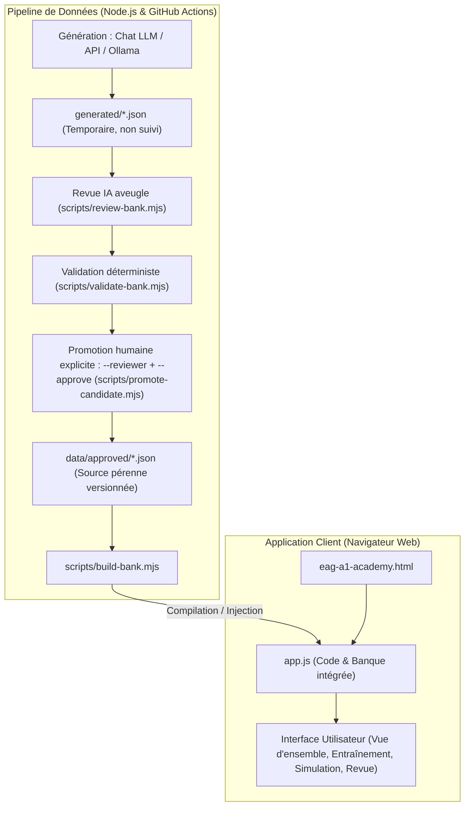
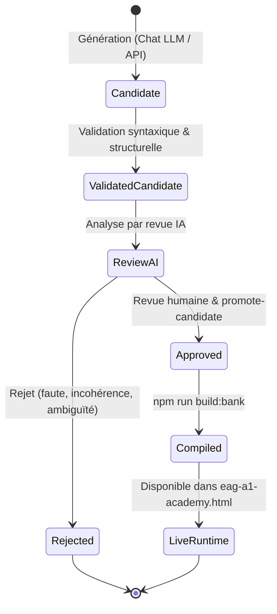

# Architecture du projet EAG A1 Académie

Ce document décrit l'architecture globale, les principes de conception technique, les flux de données et l'organisation du dépôt **EAG A1 Académie**.

---

## 1. Vue d'ensemble du système

Le projet est conçu selon deux sous-systèmes distincts et complémentaires :

1. **L'application d'entraînement côté client** : Une application web monopage (SPA) 100 % statique, exécutable sans serveur, respectueuse de la vie privée et sans dépendance d'exécution.
2. **Le pipeline de production & validation de données** : Un outillage en Node.js gérant l'ingestion, la validation déterministe, la revue critique par IA et la compilation des banques de questions.



---

## 2. Organisation du dépôt

```text
eag-a1-academy/
├── eag-a1-academy.html       # Point d'entrée de l'application (HTML5 sémantique + styles CSS)
├── app.js                    # Moteur de session, rendu réactif et banque de données compilée
├── index.html                # Redirection d'appoint vers eag-a1-academy.html
│
├── data/
│   └── approved/             # Source de vérité pérenne : fichiers JSON validés par catégorie
│       ├── abstract.json
│       ├── numeric.json
│       ├── planning.json
│       ├── situational.json
│       └── verbal.json
│
├── generated/                # Zone de travail temporaire (scratchpad) ignorée par Git
│   └── .gitkeep
│
├── schema/
│   └── question.schema.json  # Schéma JSON Schema 2020-12, appliqué par Ajv dans validate-bank.mjs
│
├── scripts/
│   ├── build-bank.mjs        # Compilation de data/approved/ vers app.js
│   ├── generate-bank.mjs     # Génération via API compatible OpenAI
│   ├── promote-candidate.mjs # Promotion humaine explicite (relecteur nommé, identifiants listés)
│   ├── review-bank.mjs       # Revue aveugle par LLM, comparée à la clé par le script
│   ├── validate-bank.mjs     # Schéma (Ajv) + règles complémentaires (HTML interdit, notes, longueurs…)
│   └── lib/ai.mjs            # Client HTTP commun compatible OpenAI
│
├── prompts/
│   ├── generate-bank.md      # Consignes système et contraintes de génération
│   └── review-bank.md        # Consignes de résolution à l'aveugle
│
├── docs/
│   ├── ARCHITECTURE.md       # Présent document
│   ├── AI-QUESTION-BANKS.md  # Guide pratique de génération et enrichissement
│   └── adr/                  # Architecture Decision Records (ADRs)
│
└── .github/workflows/
    ├── generate-test-bank.yml# Workflow de génération à la demande
    └── validate.yml          # Intégration continue (CI) et tests automatiques
```

---

## 3. Principes architecturaux clés

### 3.1. Exécution hors-ligne et compatibilité `file://`
* **Zéro serveur d'application** : L'utilisateur peut double-cliquer sur `eag-a1-academy.html` depuis son explorateur de fichiers.
* **Résolution du blocage CORS** : Les navigateurs bloquent souvent les requêtes `fetch()` vers des fichiers locaux sur le protocole `file://`. Pour contourner cette limite sans imposer de serveur web local (`localhost`), les questions validées sont compilées directement dans [`app.js`](../app.js) entre deux balises balisées :
  ```javascript
  /* QUESTION_BANK_START */
  const q = { ... };
  /* QUESTION_BANK_END */
  ```

### 3.2. Confidentialité absolue (*Privacy by Design*)
* **Aucune télémétrie ni traceur** : Zéro cookie, aucun analytics tiers, aucun appel réseau vers des API externes au runtime.
* **État volatil en mémoire vive** : Les réponses, temps de passage et résultats ne sont stockés que dans l'objet JavaScript `state` en mémoire vive. Rien n'est écrit dans `localStorage` ni `sessionStorage` ; recharger la page réinitialise complètement la session.

### 3.3. Pipeline de données *Zero-Trust*
Tout contenu généré par un LLM est traité comme suspect jusqu'à preuve du contraire :
1. **Validation déterministe** : [`scripts/validate-bank.mjs`](../scripts/validate-bank.mjs) applique le [schéma](../schema/question.schema.json) avec Ajv, puis des règles complémentaires : aucun HTML ni entité, une seule note maximale placée sur la clé (jugement situationnel), options fourre-tout interdites, bonne réponse nettement plus longue signalée, unicité des identifiants, vocabulaire interdit.
2. **Revue IA aveugle** : le modèle relecteur résout chaque item sans voir la clé ; le script compare et ne conclut `pass` qu'en cas de concordance.
3. **Approbation humaine obligatoire** : `promote-candidate.mjs` exige un relecteur nommé et la liste explicite des identifiants approuvés ; la CI refuse toute PR qui laisse des fichiers dans `generated/`.

### 3.4. Rendu sûr et neutre
* **Contenu = données** : `app.js` échappe tout le texte des items ; les tableaux et figures sont décrits en JSON structuré et construits par l'application. Un item ne peut pas injecter de balisage.
* **Ordre des options aléatoire** : les options sont mélangées à chaque affichage (sauf Vrai/Faux/On ne peut pas savoir), si bien que la position de la bonne réponse ne donne aucun indice.
* **Jugement situationnel noté** : chaque réaction est notée de 1 à 4 ; le score est la concordance avec les notes de référence (convention du projet, pas un barème officiel).
* **Aucune ressource externe** : polices système uniquement, aucun appel réseau à l'exécution.

---

## 4. Flux de données et cycles de vie

### Cycle de vie d'une question



---

## 5. Décisions d'architecture (ADR)

Les décisions structurantes du projet sont consignées sous forme d'**Architecture Decision Records** dans le dossier [`docs/adr/`](adr) :

* [ADR-0001 : Application cliente 100% statique et hors-ligne](adr/0001-static-offline-client.md)
* [ADR-0002 : Séparation physique entre `data/approved/` et le scratchpad `generated/`](adr/0002-generated-scratchpad-separation.md)
* [ADR-0003 : Pipeline Zero-Trust pour les banques de questions assistées par IA](adr/0003-ai-zero-trust-pipeline.md)
* [ADR-0004 : Synchronisation des questions par compilation dans app.js](adr/0004-build-bank-compilation.md)
* [ADR-0005 : Items en texte brut, rendu échappé et formats alignés sur GovJobs](adr/0005-plain-text-items-and-official-formats.md)
