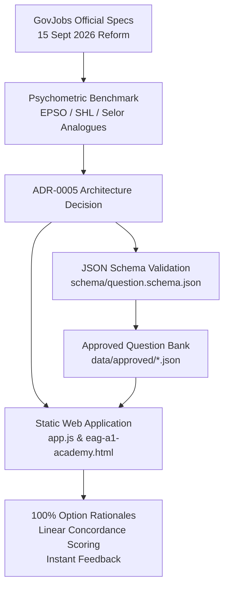

# Practice-Question Sources & Psychometric Benchmark for the Redesigned EAG A1 (Luxembourg, 15 Sept 2026)

*Last live verification & update: October 2026 (incorporating live GovJobs official portal updates and ADR-0005 bank implementation)*

This benchmark provides a comprehensive analysis of test formats, official regulations, and international psychometric analogues for the **Épreuve d'Aptitude Générale (EAG) - Groupe de traitement A1** of the Luxembourg Civil Service, reformed on **15 September 2026**.

---

## TL;DR

- **Official GovJobs Status (Confirmed Live October 2026):**
  - **No Pre-Exam Practice Questions:** GovJobs explicitly states that it **no longer provides practice or sample tests** prior to the exam (motivated by technological developments and AI to protect test equity and integrity). Candidates only encounter illustrative examples inside the computerised test interface during the initial instruction phase.
  - **Total Duration & Venue:** 2h00 computerised test at the *Centre de gestion du personnel et de l'organisation de l'État* (CGPO, Tour A, Kirchberg).
  - **Sessions:** On-demand appointments available every working day of the year on MyGuichet.lu in conjunction with a job application (semester sessions are abolished).
  - **Standardised Scoring:** Stanine scale (1 to 9) with equal weighting across sub-tests. Passing threshold: average score $\ge 5.0$.
  - **Results Validity:** 12 months from notification; valid for a single admission to internship (*stage*).
  - **Group A1 Test Suite:** Strictly 5 components:
    1. *Raisonnement abstrait* (series and geometric matrix completion)
    2. *Raisonnement verbal* (text comprehension and application of administrative instructions, V/F/I)
    3. *Raisonnement numérique* (tables, charts, financial ratios; on-screen calculator provided)
    4. *Test de planification* (agenda management under deadlines, availability, and priorities)
    5. *Test de jugement situationnel* (rating scale evaluation of appropriateness for competencies *« servir le client-usager »* and *« conseiller »*)
    *Note: Control and precision (vérification de listes) is strictly excluded for Group A1 (reserved for B1/C1).*
- **Resolution of Abstract Reasoning Format:**
  - `psychotechnique.lu` claimed odd-one-out among 9 figures.
  - **GovJobs official text officially specifies completion:** *"séries de formes ou de matrices géométriques... sélectionner l'élément qui la complète"*. As established in **ADR-0005**, the repository strictly standardises on series and 2×2 / 3×3 matrix completion.
- **Best International Analogues:**
  - **EPSO (European Personnel Selection Office):** High-calibre figural series, verbal text deduction, and numerical tables in French.
  - **SHL Direct:** Inductive sequences and multi-tab verbal/numerical items.
  - **Travaillerpour.be / Selor (Belgium):** Situational Judgement Tests with 4-level rating scales (++ to --) and constraint-based planning exercises.
  - **Public Service Commission of Canada (PSC/CFP):** 4-point and 5-point effectiveness rating scales for public-service situational judgement.

---

## Official Regulatory Framework (GovJobs Luxembourg)

Official specifications retrieved and verified live in October 2026 from the [GovJobs Official Portal](https://govjobs.public.lu/fr/nous-rejoindre/epreuve-aptitude-generale.html):

| Dimension | Official Specification | Source |
|---|---|---|
| **Reform Date** | 15 September 2026 | [GovJobs FAQ](https://govjobs.public.lu/fr/faq/faq-eag.html) |
| **Administration** | CGPO (Centre de gestion du personnel et de l'organisation de l'État), Tour A, Kirchberg | [Modalités EAG](https://govjobs.public.lu/fr/nous-rejoindre/epreuve-aptitude-generale/modalites-eag.html) |
| **Session Scheduling** | Individual appointments every working day of the year via MyGuichet.lu (min. 5 days after application, max. 10 days after deadline) | [Modalités EAG](https://govjobs.public.lu/fr/nous-rejoindre/epreuve-aptitude-generale/modalites-eag.html) |
| **Duration** | Fixed 2 hours (120 minutes) across all test components | [Modalités EAG](https://govjobs.public.lu/fr/nous-rejoindre/epreuve-aptitude-generale/modalites-eag.html) |
| **Test Languages** | Candidate chooses French or German at registration (definitive choice) | [Modalités EAG](https://govjobs.public.lu/fr/nous-rejoindre/epreuve-aptitude-generale/modalites-eag.html) |
| **Scoring Scale** | Stanine scale (1 to 9). Equal weighting across tests. | [Modalités EAG](https://govjobs.public.lu/fr/nous-rejoindre/epreuve-aptitude-generale/modalites-eag.html) |
| **Pass Threshold** | Average Stanine $\ge 5$ across all tests | [Modalités EAG](https://govjobs.public.lu/fr/nous-rejoindre/epreuve-aptitude-generale/modalites-eag.html) |
| **Result Validity** | 12 months; valid for 1 single admission to civil service stage | [GovJobs FAQ](https://govjobs.public.lu/fr/faq/faq-eag.html) |
| **Retake Policy** | 1 immediate retake allowed upon failure; second failure imposes a 12-month moratorium from 1st attempt | [GovJobs FAQ](https://govjobs.public.lu/fr/faq/faq-eag.html) |
| **Sample Material Policy** | **No public practice tests provided** prior to exam (anti-AI / integrity policy); tutorial examples provided on-screen during test instructions | [Tests EAG](https://govjobs.public.lu/fr/nous-rejoindre/epreuve-aptitude-generale/tests-eag.html) |

---

## Detailed Test Analysis & Format Concordance (Group A1)

### 1. Raisonnement abstrait (Abstract Reasoning / « Test géométrique »)

- **Official GovJobs Definition:** *"Le test de raisonnement abstrait est composé de séries de formes ou de matrices géométriques. Le candidat doit identifier les règles ou les relations qui relient les différents éléments d'une série, afin de repérer la logique qui l'unifie et sélectionner l'élément qui la complète."*
- **Candidate Terminology & « Test géométrique » :**
  - In candidate forums, prep communities, and civil service exchanges, this test is universally referred to as the **« test géométrique »** (geometric test).
  - This designation reflects the exclusive use of geometric shapes (Raven-like 3×3 matrices, rotating polygonal figures, progressive element counts, and shading symmetries).
- **Reconciliation & Format Settlement:**
  - *Discrepancy:* Commercial prep site `psychotechnique.lu` asserted that the 2026 test is exclusively an odd-one-out format (*"trouver l'intrus parmi 9 figures"*).
  - *Official Reality:* GovJobs explicitly specifies **series and matrix completion**.
  - *Implementation Decision (ADR-0005):* Standardise on pure geometric series (horizontal/vertical transformations, rotations, symmetry, progressions) and 3×3 matrix completion. Strictly exclude alphanumeric symbols or odd-one-out items.
  - *Validated Bank:* The platform provides **110 validated geometric items** conforming to project rules and aligned with this specification.
- **Top Psychometric Analogues:**
  1. **EPSO Abstract Reasoning (AST/AD samples):** Series of 5 geometric frames, 5 choices (A–E). Official European psychometric benchmark.
  2. **SHL Direct Inductive Reasoning:** Progressive transformations with verified explanations.
  3. **Travaillerpour.be / Psychotechnique.be:** Matrix completion items.

### 2. Raisonnement verbal (Verbal Reasoning)

- **Official GovJobs Definition:** *"Le test de raisonnement verbal est composé de textes, d'informations ou de consignes écrites. Le candidat doit répondre à des questions ou appliquer les consignes fournies en se basant uniquement sur les éléments présentés, sans faire appel à des connaissances extérieures."*
- **Characteristics observed in third-party prep material (not stated by GovJobs):**
  - Information organised in administrative tabs or procedural notes (described by psychotechnique.lu and Aon/cut-e-style tests).
  - Three-tier truth value: **Vrai (True) / Faux (False) / Indéterminé (Cannot Say)**. The official description only says candidates answer questions or apply instructions from the information given; the response format is not published.
  - Focus on formal logic: contrapositives, quantifiers (*« tous »*, *« certains »*, *« aucun »*, *« exclusivement »*), possibility vs necessity.
  - Application of administrative procedures and circulars without external bias.
- **Top Psychometric Analogues:**
  1. **Aon / cut-e "scales verbal":** Multi-tab reading comprehension with strict T/F/Cannot say response mode.
  2. **SHL Direct Verbal (FR):** Administrative passages with formal deduction questions.
  3. **Travaillerpour.be (Selor FR):** Belgian federal civil service verbal reasoning mini-tests based on administrative guidelines.

### 3. Raisonnement numérique (Numerical Reasoning)

- **Official GovJobs Definition:** *"Le test de raisonnement numérique est composé d'exercices basés sur des tableaux, des graphiques, des données chiffrées ou des opérations simples. Le candidat doit manipuler des nombres et interpréter les informations disponibles pour répondre correctement, sans faire appel à des connaissances extérieures. Vous pouvez utiliser la calculatrice de l'ordinateur pour le test de raisonnement numérique ; l'utilisation de votre propre calculatrice est interdite."*
- **Key Characteristics:**
  - Multi-year budgetary tables, demographic trends, indexation, public expenditure.
  - Core operations: compound percentages, percentage points vs percent changes, weighted ratios, extrapolations.
  - Integration with standard on-screen digital calculator.
- **Top Psychometric Analogues:**
  1. **EPSO Numerical Reasoning (FR):** Data-dense public administration tables and multi-step percentage calculations.
  2. **SHL Direct Numerical (FR):** Statistical tables, balance sheets, and resource projections.
  3. **Open Exam Prep Luxembourg:** Civil service word problems (budget allocations, civil servant headcount).

### 4. Test de planification (Planning & Agenda Management)

- **Official GovJobs Definition:** *"Ce test évalue la capacité du candidat à planifier et organiser son travail de manière logique. Le candidat doit gérer un agenda, en tenant compte des délais, des disponibilités et des priorités."*
- **Key Characteristics:**
  - Complex calendar/agenda scheduling over half-day, full-day, or weekly grids.
  - Multiple simultaneous constraints: fixed immovable meetings, availability windows, minimum task durations, sequential dependencies (*« immédiatement après »*, *« avant midi »*), buffer times.
  - No catch-all distractors (*« aucun de ces créneaux »* prohibited): questions must present valid concrete time windows or specific task allocations.
- **Top Psychometric Analogues:**
  1. **psychotechnique.lu (Agenda Simulation):** Worked half-day scheduling grid with sequential constraints.
  2. **Bundesagentur für Arbeit (DE) Postkorb/Terminkalender:** Realistic calendar building with collision handling and prioritisation.
  3. **Concours-Formation (FR):** Workshop and administrative schedule planning under resource constraints.
  4. **EPSO Prioritising & Organising (AST P&O):** Time budgeting and schedule feasibility checks.

### 5. Test de jugement situationnel (Situational Judgement Test - SJT)

- **Official GovJobs Definition:** *"Ce test place le candidat face à des mises en situation professionnelles. Pour chaque scénario, plusieurs réponses ou comportements possibles sont proposés ; le candidat doit évaluer leur pertinence au regard du contexte présenté. Pour les groupes de traitement A1 et A2, le test porte sur les compétences « servir le client-usager » et « conseiller »."*
- **Key Characteristics:**
  - High-level civil service scenarios: counter interactions, angry or distressed citizens, incomplete legal files, confidential disclosures, inter-departmental mediation.
  - **Competency 1: « Servir le client-usager »:** Empathy, institutional neutrality, active listening, search for constructive legal solutions, de-escalation.
  - **Competency 2: « Conseiller »:** Objective pedagogical explanations, neutrality, presenting clear administrative recourse and alternatives without making subjective promises.
  - **Response Format:** Rating scale evaluating each proposed action independently (1 = Très inapproprié à 4 = Très approprié), reflecting the official requirement to *"évaluer leur pertinence au regard du contexte présenté"*.
- **Top Psychometric Analogues:**
  1. **Travaillerpour.be / Selor SJT (FR):** 4-point rating scale (++ / + / - / --) evaluating individual reactions in public service contexts.
  2. **Public Service Commission of Canada (PSC/CFP - Tests 318 & 375):** Effectiveness rating scales for public administration professionals.
  3. **France Travail (Aon SJT):** Citizen service scenarios with conflict resolution and advisory dilemmas.

---

## Outdated Formats to Avoid (Pre-2026 EAG)

Prior to 15 September 2026, the EAG included components that have been completely eliminated or relocated:
- **« Bac à courrier » (E-tray / In-basket):** Replaced by the modular *Test de planification* (agenda) and *Test de jugement situationnel*. Articles describing e-tray (e.g., ORSEU 2025, RoomSpace pre-reform blogs) describe the deprecated system.
- **Test de contrôle et de précision:** Strictly restricted to Groups B1 and C1. Preparing this test for Group A1 is unnecessary.
- **Indefinite or 5-Year Validity:** Validities obtained before 15.09.2026 remain valid for 5 years, but all successes post-reform are valid for **12 months** only.

---

## Transposition & Implementation in EAG A1 Académie

The findings from this benchmark have been directly operationalised in the architecture of **EAG A1 Académie** (October 2026):

1. **Question Schema & Strict Validation ([`schema/question.schema.json`](../../schema/question.schema.json)):**
   - Formal schema enforced via Ajv 8 in `scripts/validate-bank.mjs`.
   - Rejection of lazy distractors (regex check against *« aucune des réponses »*, *« tous les choix »*).
   - Mandatory `optionRationales` for **all** options, ensuring candidates understand why distractors are psychometrically suboptimal.
2. **Standardised Rating Scale for SJT:**
   - Implemented as a 4-level scale ($1 = \text{Très inapproprié}$, $2 = \text{Inapproprié}$, $3 = \text{Approprié}$, $4 = \text{Très approprié}$).
   - Scored via continuous linear concordance:
     $$\text{score} = \max\left(0, 1 - \frac{|\text{userRating} - \text{targetRating}|}{3}\right)$$
   - Full credit (1.0) for exact match, 0.67 for adjacent ratings, 0.33 for distance 2, 0.0 for polar opposition.
3. **Local Offline Determinism & 592-Question Validated Bank:**
   - Precompiled into `bank/app-bank.js` and `bank/admin-bank.js` via `npm run build:bank` with zero runtime network dependencies.
   - Bank of **592 validated items** (RA 110, RV 110, RN 146, PL 126, JS 100).
   - Dynamic random sampling without replacement (Fisher-Yates) on session launch (5 items by default for guided practice, 15 for simulation, 5 tests for exam mode) ensuring high replay value and broad coverage.

---

## Sources & References

### Official Luxembourg Government Portals (Verified Live October 2026)
1. **[GovJobs - Accueil Épreuve d'aptitude générale](https://govjobs.public.lu/fr/nous-rejoindre/epreuve-aptitude-generale.html)**
2. **[GovJobs - Les tests de l'épreuve d'aptitude générale (Descriptions officielles)](https://govjobs.public.lu/fr/nous-rejoindre/epreuve-aptitude-generale/tests-eag.html)**
3. **[GovJobs - Modalités de l'épreuve d'aptitude générale (Durée 2h, Stanine, Déroulement)](https://govjobs.public.lu/fr/nous-rejoindre/epreuve-aptitude-generale/modalites-eag.html)**
4. **[GovJobs - FAQ officielle sur l'EAG et la réforme](https://govjobs.public.lu/fr/faq/faq-eag.html)**
5. **[Chambre des Députés du Luxembourg - Projets de loi sur la modernisation de la fonction publique (mai 2026)](https://chd.lu)**

### International Psychometric & Civil Service Benchmarks
6. **[EU Careers / EPSO - Sample Reasoning Tests (EN/FR)](https://eu-careers.europa.eu/en/assistants-ast-1-ast-9)**
7. **[SHL Direct - Practice Tests & Example Questions (FR/EN)](https://www.shl.com/shldirect/fr/example-questions/)**
8. **[Travaillerpour.be / Psychotechnique.be - Tests de jugement situationnel et logique](https://psychotechnique.be/travaillerpourbe-test-jugement-situationnel/)**
9. **[Public Service Commission of Canada - Situational Judgement Tests (SJT 318 & 375)](https://www.canada.ca/en/public-service-commission/services/staffing-assessment-tools-resources/human-resources-specialists-hiring-managers/human-resources-toolbox/personnel-psychology-centre/consultation-test-services/public-service-commission-tests/situational-judgement-test-sjt-318/situational-judgement-test-318-sample-situations-questions.html)**
10. **[Bundesagentur für Arbeit - Übungen für das Assessment-Center (Terminkalender)](https://www.arbeitsagentur.de/bildung/bewerbung/assessmentcenter-uebung)**
11. **[Concours-Formation - Tests psychotechniques d'organisation et plannings](https://concours-formation.fr/tests-psychotechniques-plannings/)**
12. **[psychotechnique.lu - Réussir l'EAG GovJobs Luxembourg 2026 (Commercial overview)](https://psychotechnique.lu/examen-etat-luxembourg/)**
